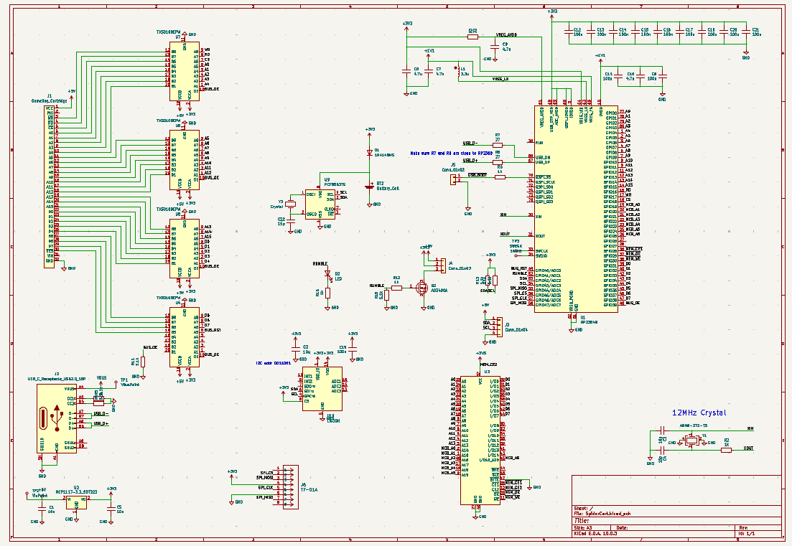
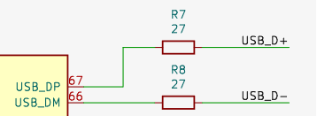
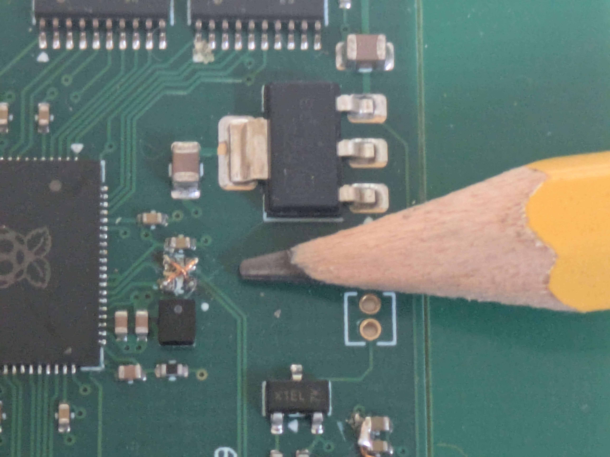
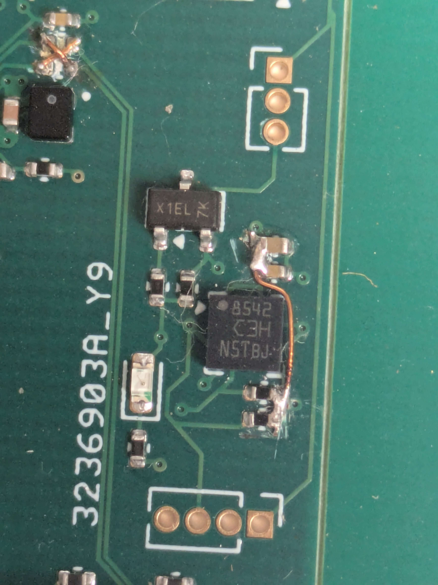
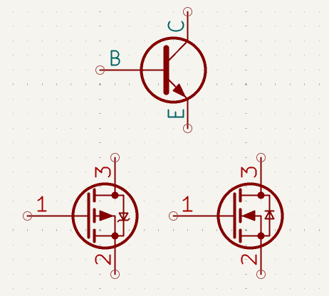

# Hardware

The SpiderCart hardware is designed about the following main princible:
* The RP2354 MCU is the brains of the cartridge, and handles most things.
* To support big enough roms, an external RAM chip is directly attached to the gameboy cartridge bus but enabled from the MCU.
* Additional chips can be attached to the MCU for extra features.

As the main design evolves around the RP2354, the [RaspberryPi RP2350 hardware design documentation](https://pip-assets.raspberrypi.com/categories/1214-rp2350/documents/RP-008280-DS-1-hardware-design-with-rp2350.pdf) was of vital importance. The reference design from RaspberryPi for the RP2350 was copied 1:1. But I did make a few adjustements for a 4 layer board instead of the 2 layer reference design.

For the gameboy cartridge bus connection, [Gekkio already made perfect cart edge connectors](https://github.com/Gekkio/gekkio-kicad-libs/tree/main/Gekkio_Connector_PCBEdge.pretty) so it would be stupid not to use these.

## MCU Pins

The RP2354 comes in two different packages, one with 29 GPIO pins and one with 48 GPIO pins. The gameboy cartridge bus has 8 data pins, 16 address pins, and 4 control signals. So the 29 GPIO version quickly can be ignored.

To connect everything that is essential, we'll need:

* Gameboy Bus: 16 address pins
* Gameboy Bus: 8 data pins
* Gameboy Bus: 4 control lines (RD/WR/CS/Rst)
* RAM chip: Enable, chip select, and write
* RAM chip: Higher address pins (up to 9 for 8MB roms)
* SPI bus for SD card: SPI bus using 4 pins

Have you kept count? We are up to 44 pins already. So there are 4 left. But... we are not done yet.

* Add a pin for a rumble motor.
* Add 2 pins for an I2C bus towards RTC/Accelerometer (and potentially more)
* Add 1 pin to enable/disable level shifters towards the gameboy. (see next section)

And just like that, we are out of pins. In theory a few things could be multiplexed on the same pins, but that would make software more complicated and error prone.

## Level shifting

As mentioned, there are level shifters. The gameboy cartridge bus runs at 5V, which was pretty much the standard back in those days. However, electronics have shifted to 3.3V or even 1.8V power levels. Luckily this is a common problem and translator chips between these voltages exist and are not that expensive. Even the cheap ones can get up to a 100Mhz, and with the bus running at 4Mhz there is no problem in adding these.

These level shifters give another additional bonus. From a single pin of the MCU we can completely isolate the cartridge from the gameboy bus. This is useful, as it allows the MCU to write to the RAM chip using the same data/address bus as the gameboy normally uses. Without the Gameboy being able to cause any interference.

In theory, the Gameboy could be held in reset to release the bus. However, I could not find any documentation that this is guaranteed. AND using this 1 pin to disable the bus, we also have the capability to update the ROM data while the gameboy keeps running, as long as the gameboy does not try to access the cartridge during this time.

This last bit is used to implement "quickboot" in the loader. Where you can select a rom, and have it instantly starting instead of first seeing the Gameboy boot logo again.

## Power

As mentioned, we need 3.3V power. But the gameboy gives 5V. So we need to "drop" this down to 3.3V. For V1 of the SpiderCart I opted to use a simple LDO. This isn't the most efficient in power usage, but it is simple and reliable.

As for power consumption. We did a quick measurement of consumption compared to an EZ Flash Jr. I measured my cartridge at 30mA on the 5V bus, while the EZ Flash Jr did 23mA. So that's about a 30% increase there, not great. And I'm not sure if this is due to the LDO or just the general design being power hungry. Comparing with [Gekkio's results](https://gekkio.fi/blog/2021/power-consumption-of-game-boy-flash-cartridges/) it seems on par with an old Everdrive GB. (Note that I measured consumption at the cartridge bus, while Gekkio measured consumption at the battery, so when comparing you need to adjust for that)

## V1 mistakes

The hardware I have right now are V1 boards. V1 boards are limited to 2MB rom due to part availability, and not wanting to risk a BGA chip that I could not patch.

I took quite a risk by ordering 5 boards of a completely untested design. And, with any PCB design you will make mistakes. It was good fortune that every single mistake was fixable. All these mistakes have been fixed in the repository design files.

### Oops 1: Swapped USB lines

During early development of the hardware, I copied the Raspberry Pi reference design for the RP2350B chip. But, I replaced the custom symbols with default KiCad symbols where possible. In this process a mistake creeped in.

The reference schematic has the following layout for the USB pins.

I copied this, but the KiCad symbol has the USB pins on the other side. So I mirrored it and be done.

See what I missed? It's easy to miss. The DM and DP pins are swapped. This was fixed by removing the R7 and R8 resistors and adding two small wire bridges to swap the lines. While these resistors are required by the standard, in practice they are not really needed.

I had a colleague do this patch, and he did an amazing job.

### Oops 2: Pull...downs?

Some extra functionality is handled by chips connected to an I2C bus. Which is an easy way to connect multiple chips with just using 2 pins. Now, these two pins need pullups. You often see the pullups of the microcontroller being used, however, these can cause problems. So for the best performance you add external pullups. And you connect those to 3.3V, not to GND like an moron. So, yes. I connected my pullups to ground, making them pulldowns.

A simple test with removing the pulldowns and using the internal pullups in the microcontroller proved that this was indeed the main problem. I came up with the following patch for the remainder of the boards:

Where the trace to the via is cut (green line) and a wire patch is made following the side of the accelerometer chip to the decouping capacitors of that chip.

I was kinda afraid to damage the accelerometer chip. But this patch came out fine.

### Oops 3: Get ready to rumble!

Rumble all the time that is. I put the wrong type of FET in the schematic, and that causes the rumble motor to be always on. Swapping the P-Channel FET out for an N-Channel fixes this. This pretty much comes down to my unfamiliarity with the FET schematic symbols. I am familiar with the normal transistor symbols.

So, little quiz, which of the bottom symbols behaves like the top one?

I wrongfully assumed, the left one. On closer inspection, that can never be right due to the internal diode shown there. And the right symbol is the right one.

Luck be hold, this is just a drop-in replacement from an AO3401 to an AO3400. A bigger issue was getting a tiny supply of these for cheap without breaking the bank on shipping. As these FETs cost a few cents if you place them on a board, but if you order them at single pieces and have them shipped, you quickly look at 2-3 euro a piece. In the end I managed to find a local dealer and got replacements for 3 euro including shipping.

* Back to [overview](./index.html)