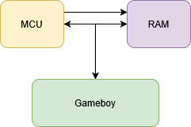

# General

The design of the Gameboy SpiderCart is made to be able to do a few major features:

* General flash cart for known ROMs. Including ones that require additional features in the cartridge.
* Additional functionality by means of a co-processor.

While discussion about Flash Cart design online, the conclusion was drawn that the base of this could very well be achieved with a single microcontroller and external RAM chip. And additional chips can be added for specific features.

## Core functioning

The Gameboy SpiderCart primary needs to do two things:

* "Emulate" the ROM interface to the Gameboy
* "Emulate" the SRAM interface to the Gameboy

While they sound very simular, there are differences. The primary thing is that SRAM emulation is fully done by the microcontroller while the ROM emulation is done with the microcontroller enabling the external RAM chip and having the gameboy read data from the RAM chip as if it is ROM.

## Terminology

As we are talking about the technical side of the SpiderCart it uses a lot of terminology. This list ensures that we all speak the same language.

* DMG: The origonal grey brick gameboy. With 4 "green" colors.
* GBC: The Gameboy Color. Upgraded version of the grey brick with color support, double CPU speed and a few more things.
* MCU: Microcontroller. In this case the RP2354B from Raspberry Pi. The RP2354B is a RP2350 with internal flash, so references to RP2350 are also refering to this chip.
* SRAM: "Save" ram. This is also called "external ram" from the gameboy perspective, and contained within the cartridge. Optionally this is preserved between power cycles. Not to be confused with "Static RAM" which is a name of a specific type of RAM chips (to which we just refer as RAM chip)
* RTC: A clock. The gameboy documentation usually refers to this as the Timer. It keep "clock"/"wall" time. Even when the gameboy is off. This requires a battery to preserve state.
* Firmware: Code installed on the MCU that facilitates the operation of the flash cart
* Loader: The code running on the gameboy that allows selecting of rom files and potentially do other things.
* ROM: Abbreviation of Read Only Memory. But in the Gameboy world synonym to a game. Contains the code/data/graphics for a Gameboy game. Generally stored in .gb/.gbc files.

## Side reading

There is a quite a lot of information available on the internet about the Gameboy.

* [gbdev.io](https://gbdev.io/) The gbdev.io community collection is a good starting point for a lot of things.
* [pandocs](https://gbdev.io/pandocs/) The pandocs are the reference document for lots of things gameboy related.

* Back to [overview](./index.html)