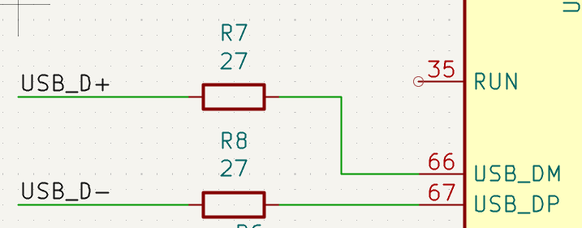
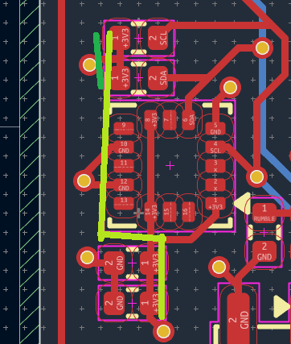

# Hardware

TODO

## V1 mistakes

I took quite a risk by ordering 5 boards of a completely untested design. And, with any PCB design you will make mistakes. It was good fortune that every single mistake was fixable. All these mistakes have been fixed in the repository design files.

### Oops 1: Swapped USB lines

During early development of the hardware, I copied the Raspberry Pi reference design for the RP2350B chip. But, I replaced the custom symbols with default KiCad symbols where possible. In this process a mistake creeped in.

The reference schematic has the following layout for the USB pins.

I copied this, but the KiCad symbol has the USB pins on the other side. So I mirrored it and be done.

See what I missed? It's easy to miss. The DM and DP pins are swapped. This was fixed by removing the R7 and R8 resistors and adding two small wire bridges to swap the lines.

> TODO: Insert photo of the patch.

### Oops 2: Pull...downs?

Some extra functionality is handled by chips connected to an I2C bus. Which is an easy way to connect multiple chips with just using 2 pins. Now, these two pins need pullups. You often see the pullups of the microcontroller being used, however, these can cause problems. So for the best performance you add external pullups. And you connect those to 3.3V, not to GND like an moron. So, yes. I connected my pullups to ground, making them pulldowns.

A simple test with removing the pulldowns and using the internal pullups in the microcontroller proved that this was indeed the main problem. I came up with the following patch for the remainder of the boards:

Where the trace to the via is cut (green line) and a wire patch is made following the side of the accelerometer chip to the decouping capacitors of that chip.

> TODO: Insert photo of the patch.

### Oops 3: Get ready to rumble!

Rumble all the time that is. I put the wrong type of FET in the schematic, and that causes the rumble motor to be always on. Swapping the P-Channel FET out for an N-Channel fixes this. This pretty much comes down to my unfamiliarity with the FET schematic symbols.

Luck be hold, this is just a drop-in replacement.
